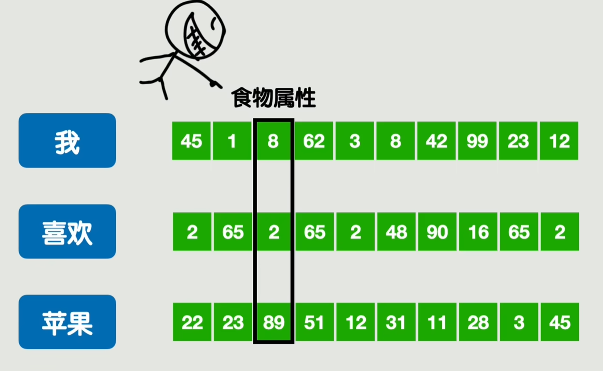
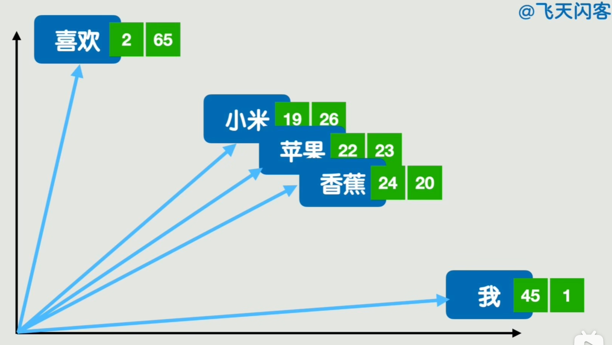
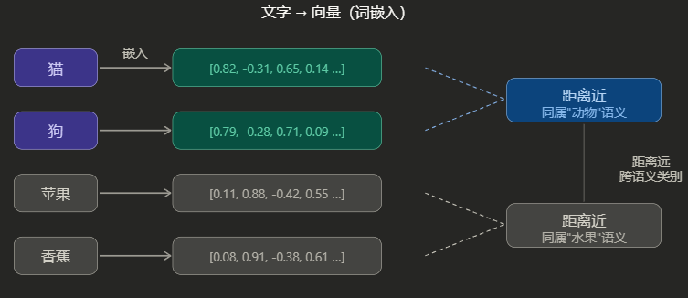

## 一、LLM输出简化流程

```mermaid
flowchart LR
    A["输入文本"] --> B["分词(Token化/Tokenizer)"]
    B --> C["向量化(Embedding)"]
    C --> D["Transformer Attention × N 层"]
    D --> E["概率分布"]
    E --> F["采样
		选出下一 token"]
    F --> G["拼接输出
		追加到输入序列"]
    G -->|"未到终止符"| D
    G -->|"到达终止符"| H["Token 序列
		完整 token 列表"]
    H --> I["反向解码
		Detokenizer"]
    I --> J["最终文本
		人类可读输出"]

    style A fill:#E1F5EE,stroke:#0F6E56,color:#085041
    style B fill:#E1F5EE,stroke:#0F6E56,color:#085041
    style C fill:#EEEDFE,stroke:#534AB7,color:#3C3489
    style D fill:#FAEEDA,stroke:#854F0B,color:#633806
    style E fill:#FAEEDA,stroke:#854F0B,color:#633806
    style F fill:#FAECE7,stroke:#993C1D,color:#712B13
    style G fill:#FAECE7,stroke:#993C1D,color:#712B13
    style H fill:#FAECE7,stroke:#993C1D,color:#712B13
    style I fill:#E1F5EE,stroke:#0F6E56,color:#085041
    style J fill:#EAF3DE,stroke:#3B6D11,color:#27500A
```

### 黑盒视角： `输入` → `黑盒` → `输出`

1. **`分词(Token化/Tokenizer)`**

   - `分词`是是其中准备`输入`的步骤，用于将人类语言拆分为语义的最小单元，方便`Transformer`处理。
   - 中文是字或词，英文是字母、词根或单词，数字，标点符号以及空格、换行符等，都算是`Token`。可以理解为语素，即语言中最小的有意义单位。
2. **`向量化(Embedding)`**

   - `向量化`是其中准备`输入`的步骤，用于将人类语言转为计算机语言。
   - 每个`Token`在`向量化`后，都可以理解为一个数组。数组的每一位都代表这个`Token/分词`在某个维度上的关联程度，数值可以为负数，越大越相关。
   - 
   - 至于为什么叫`向量化`，可以参考下面数组长度为2时的示例，LLM中只是轴多了一些：
   - 
   - 
3. **Transformer × N 层**

   - 可以简单理解为，一种计算各个Token之间关系的算法。
   - 训练时记录Token之间的关系。
   - 推理时使用训练时记录到的数据，来预测位于语句最末尾的Token。
4. **概率分布(采样,选出下一Token)**

   - 根据策略或超参数，来影响不同Token出现的概率，从而控制输出倾向。
   - 最典型的比如 Temperature 参数用于控制生成文本时**随机性、创造性和多样性**的超参数。

## 二、LLM缺陷

1. **幻觉**

   - **事实性幻觉**：生成与现实世界相矛盾的内容。
   - **忠实性幻觉**：输出与用户指令或上下文不一致。
2. **讨好性/安全性/不鲁棒性**

   - 对问题的预设答案、对输出的质疑会影响输出结果，使LLM的输出更偏向人类意图，而非既定事实。
   - 任何以提示词形式对LLM进行安全管制的方案，都有可能不遵守，或被提示注入攻击攻破。
3. **上下文相关**

   - **上下文长度：**  LLM一次能处理的信息量有限，目前普遍上限为200K，超过这个范围会导致性能急剧下降。
   - **注意力：** LLM 对上下文的利用不均匀——对开头和结尾信息记忆好，对中间信息系统性遗忘。这意味着即使上下文窗口"放得下"，信息位置本身就会影响回答质量。
4. **数据问题**

   - **数据老旧：** 新旧知识在LLM中是同时存在的，每次LLM迭代升级，都是在旧模型上继续训练，旧数据仍存在LLM中对输出造成影响。
   - **数据偏见：** LLM 从训练语料中继承并放大社会偏见，涵盖性别、种族、文化、宗教等维度，在涉及敏感话题的提示下会产生歧视性输出。
5. **能力问题**

   - **锚定效应：** LLM 对信息给出的顺序高度敏感，先出现的信息会不成比例地主导后续推理。
   - **框架效应**：逻辑等价但表述不同的提示，会导致截然不同的输出。
   - **偷懒：** LLM 倾向于使用记忆中的规则和简单数值模式，而非执行真正的算法计算或是推理。
   - **记忆：** 无持久化记忆能力。

## 参考资料

- [https://transformers.run/](https://transformers.run/) Transformers 快速入门
- [https://www.bilibili.com/video/BV1oNv8BPE2m](https://www.bilibili.com/video/BV1oNv8BPE2m) 15分钟弄懂Token和Embedding -- 详解LLM与RAG的数据处理机制
- [https://www.bilibili.com/video/BV1C3dqYxE3q](https://www.bilibili.com/video/BV1C3dqYxE3q) Transformer 其实是个简单到令人困惑的模型【AI入门06】
- [https://xiaosheng.blog/2022/04/04/transformers-biography](https://xiaosheng.blog/2022/04/04/transformers-biography) Transformer 模型通俗小传

- [https://medium.com/data-bistrot/15-artificial-intelligence-llm-trends-in-2024-618a058c9fdf](https://medium.com/data-bistrot/15-artificial-intelligence-llm-trends-in-2024-618a058c9fdf) 18 Artificial Intelligence LLM Trends in 2025
- [https://arxiv.org/pdf/2509.19326](https://arxiv.org/pdf/2509.19326)  Chroma Research
- [https://arxiv.org/html/2505.19240v1](https://arxiv.org/html/2505.19240v1) LLLMs: A Data-Driven Survey of Evolving Research on Limitations of Large Language Models

- [https://magazine.sebastianraschka.com/p/state-of-llms-2025](https://magazine.sebastianraschka.com/p/state-of-llms-2025) The State Of LLMs 2025: Progress, Problems, and Predictions